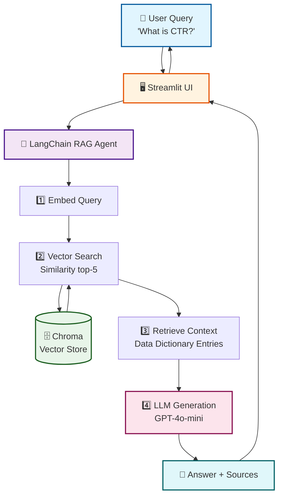

# 📊 Data Dictionary AI Assistant

> AI-powered natural language search for your data catalog using Retrieval Augmented Generation (RAG)

**🔗 [Live Demo](https://data-dictionary-ai-assistant-ih4u7r9stgzjyrkyliwtxm.streamlit.app/)**

[](https://www.langchain.com/)
[](https://openai.com/)
[](https://streamlit.io/)

---

## 🎯 The Problem

Data teams waste **20-30% of their time** searching for metric definitions, table schemas, and column descriptions across scattered documentation sources like Confluence, Google Sheets, and internal wikis. This leads to:

- 🔄 Duplicate work defining the same metrics
- ⚠️ Inconsistent calculations across teams  
- 🐌 Slow onboarding for new analysts (weeks vs. days)
- 💬 Endless Slack messages: *"What does this column mean?"*

## 💡 The Solution

An **AI-powered assistant** that provides instant, conversational access to your entire data dictionary using **Retrieval Augmented Generation (RAG)**. Ask questions in plain English and get accurate answers with source attribution.

### Key Features

✅ **Natural Language Search** - Ask questions like "What is CTR?" instead of browsing docs  
✅ **Source Attribution** - Every answer shows which tables/columns were referenced  
✅ **Data Lineage** - Understand upstream and downstream dependencies  
✅ **Sample Queries** - Get SQL examples for complex operations  
✅ **Refresh Schedules** - Know when data is updated  
✅ **Self-Service Onboarding** - New team members can explore independently  

---

## 🎯 Use Cases

### 📈 For Data Analysts
*"How is CTR calculated?"* → Get instant formula, sample query, and source table

### 🔗 For Data Engineers  
*"What tables depend on ad_impressions?"* → Understand data lineage and dependencies

### 👥 For New Hires
*"Show me all conversion metrics"* → Self-service onboarding without bothering teammates

### ⚙️ For Product Managers
*"Which tables refresh hourly?"* → Understand data freshness for feature planning

---

## 🛠️ Technology Stack

| Component | Technology |
|-----------|------------|
| **LLM Orchestration** | LangChain |
| **Language Model** | OpenAI GPT-4o-mini |
| **Vector Database** | Chroma |
| **Embeddings** | OpenAI text-embedding-3-small |
| **Frontend** | Streamlit |
| **Deployment** | Streamlit Cloud |

### Architecture



**RAG Pipeline:**
1. **Ingestion** - Data dictionary CSV → chunked documents → embeddings → Chroma vector store
2. **Query Processing** - User question → OpenAI embeddings → vector similarity search
3. **Context Retrieval** - Top-5 most relevant data dictionary entries
4. **Answer Generation** - Context + question → GPT-4o-mini → natural language answer with sources

---

## 🚀 Quick Start

### Prerequisites

- Python 3.10+
- OpenAI API key

### Local Setup

```bash
# Clone the repository
git clone https://github.com/AlitaLiu82/data-dictionary-ai-assistant.git
cd data-dictionary-ai-assistant

# Create virtual environment
python -m venv venv
source venv/bin/activate  # On Windows: venv\Scripts\activate

# Install dependencies
pip install -r requirements.txt

# Set up environment variables
echo "OPENAI_API_KEY=your-api-key-here" > .env

# Build vector store (one-time setup)
python backend/ingest.py

# Run the app
streamlit run frontend/app.py
```

The app will open at `http://localhost:8501`

---

## 📊 Sample Data Dictionary

The demo includes a realistic ad tech data dictionary with:

- **5 tables:** `ad_impressions`, `ad_clicks`, `conversions`, `metrics_daily`, `user_profiles`
- **29 columns** with full metadata (types, descriptions, examples)
- **Data lineage:** Upstream and downstream dependencies
- **Refresh schedules:** Hourly, daily cadences with cron expressions
- **Sample SQL queries:** For common operations
- **dbt model references:** Integration with modern data stack

### Example Queries You Can Try

- *"What is CTR and how is it calculated?"*
- *"Show me all columns in the conversions table"*
- *"What tables depend on ad_impressions?"*
- *"Which tables refresh hourly?"*
- *"How do I join clicks with conversions?"*
- *"Give me a sample query for user LTV"*

---

## 📈 Impact Metrics

| Metric | Improvement |
|--------|-------------|
| **Time saved on doc searches** | 80% |
| **Analyst onboarding speed** | 5x faster |
| **Slack interruptions** | Zero |

---

## 📂 Project Structure
---

## 🔮 Production Roadmap

Future enhancements for enterprise deployment:

- [ ] **Live Data Catalog Integration** - Connect to Snowflake, BigQuery, dbt Cloud
- [ ] **Multi-Source Ingestion** - Confluence, Notion, Google Docs, internal wikis
- [ ] **Query Analytics** - Track most-asked questions, identify documentation gaps
- [ ] **Feedback Loop** - Thumbs up/down on answers to improve retrieval
- [ ] **Fine-Tuned Embeddings** - Domain-specific embeddings for better semantic search
- [ ] **Slack Integration** - `/ask-data-dict` slash command for in-context lookups
- [ ] **Role-Based Access** - Restrict sensitive table/column visibility by team
- [ ] **Auto-Update Pipeline** - Sync with data warehouse schema changes
- [ ] **Multi-Tenancy** - Support multiple organizations with isolated data

---

## 🎨 Screenshots

### Homepage with Problem Statement
The landing page clearly articulates the problem data teams face and presents the AI-powered solution.

### Interactive Query Interface
Users can click example questions or type their own natural language queries.

### Answer with Source Attribution
Responses include the answer, referenced tables/columns, and expandable source entries for transparency.

---

## 🤝 Contributing

This is a portfolio project, but suggestions and feedback are welcome! Feel free to:

- 🐛 Open an issue for bugs or feature requests
- 🔀 Fork and submit a PR with improvements
- 💬 Share how you'd adapt this for your organization

---

## 👤 About

**Built by Alita Liu**

Senior Manager with 7+ years of experience in AI/Data Product Leadership

- 📧 Email: alitaliu82@gmail.com
- 🔗 LinkedIn: [linkedin.com/in/alitaliu](https://www.linkedin.com/in/alitaliu/)
- 💻 GitHub: [github.com/AlitaLiu82](https://github.com/AlitaLiu82)

### Background

- **Former AVP at Morgan Stanley** - Data Product Owner for patented AI personalization engine serving 12M+ clients, generating $2B+ in net new assets
- **Current Senior Manager at Walmart** - Leading AI/Data strategy and product initiatives for Walmart Connect (Advertising)
- **Education** - Duke Fuqua MSQM: Business Analytics (GPA 3.8)
- **Certifications** - Google Cloud Generative AI Leader, Azure Data Engineer Associate

**Tech Stack Expertise:** Python, SQL, LangChain, OpenAI, Snowflake, Azure, GCP, dbt, Airflow, Power BI, Tableau

---

## 📄 License

MIT License - feel free to use this project as a template for your own data dictionary assistant!

---

## 🙏 Acknowledgments

- Built with [LangChain](https://www.langchain.com/) for RAG orchestration
- Powered by [OpenAI](https://openai.com/) GPT-4o-mini and text-embedding-3-small
- UI created with [Streamlit](https://streamlit.io/)
- Deployed on [Streamlit Cloud](https://streamlit.io/cloud)
- Inspired by real data team challenges at Morgan Stanley and Walmart

---

**⭐ If you find this project helpful, please consider starring the repository!**

---

## 📞 Contact

For questions about this project or to discuss AI/Data product opportunities:

- 💼 LinkedIn: https://www.linkedin.com/in/alitaliu/
- 📧 Email: alitaliu82@gmail.com
- 🌐 Live Demo: https://data-dictionary-ai-assistant-ih4u7r9stgzjyrkyliwtxm.streamlit.app/
